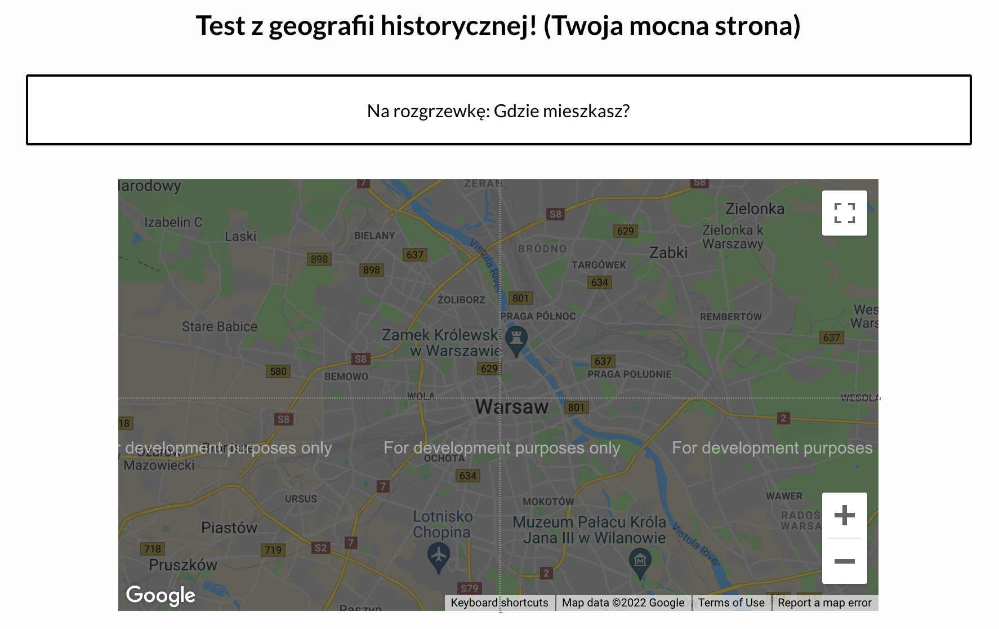
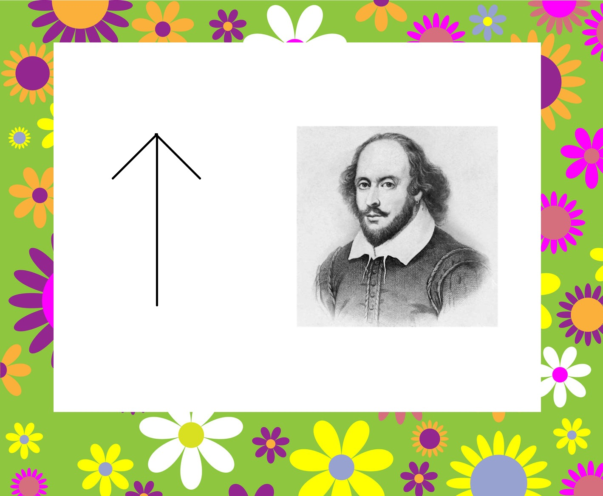
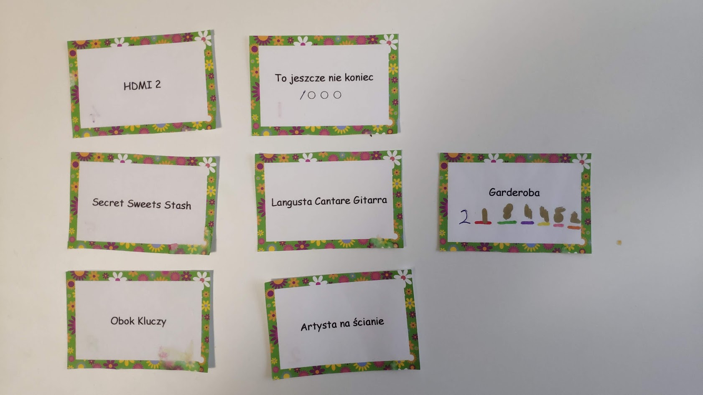

# 2021

## początek
- żeby rozpocząć grę trzeba wysłuchać Ryszarda rynkowskiego i odblokować quiz (super tajny kod)

## Quiz 1

- quiz jest podzielony na cztery kategorie odblokowywane jedna po drugiej
    - wiedza ogólna (pytania głównie o bajki Janka)
    - historia (pytania do zdjęć Kasi z przeszłości)
    - geografia - tutaj odpowiedzią na poszczególne pytania są przybliżone koordynaty, które trzeba wzkazać przy pomocy google mapy (odpowiednie miejsce z mapy trzeba przesunąć na środek widgetu)
      
    - runda finałowa - tutaj trzeba było wypełnić pola odpowiedziami uzyskanymi od przyjaciół i drugich przyjaciół (Tkaczyki i Siatole byli zaangażowani).

## Poszukiwania 1

- po uzupełnieniu rundy finałowej wyskakuje komunikat "zajrzyj do piekarnika".
- w zabawkowym piekarniku Janka była karteczka "Artysta na ścianie"
- za zdjęciem Olka była karteczka z napisem "HDMI 2"
- Do TV pod portem HDMI2 podłączone było rapberry Pi z ustawionym obrazkiem:

- nad telewizorem jedna książka Shakespeare'a była do góry nogami a w niej karteczka z napisem "Obok kluczy"
- w szufladzie obok szuflady z kluczami pierwszy prezent - pierścionek z "S" (i karteczka "To jeszcze nie koniec /ooo)
- po wspisaniu `/ajs` na kasiunia.com odblokowuje się drugi quiz

## Quiz 2

- drugi quiz składa się z trzech części
    - matematyka - seria co raz trudniejszych równań do rozwiązania ale kolejne odpowiedzi to: 2 8 0 7 9 1
    - muzyka - teksty piosenek z lukami do uzupełnienia (teksty w wersji prawdziwej lub "domowej")
    - runda naprawdę finałowa - tutaj tylko obrazek wieszaka

## Poszukiwania 2

- po uzyskaniu od Wieszaków podpowiedzi "tam gdzie powinna być szuflada" - w miejscu na szufladę w stole była karteczka "Secret sweet stash"
- w miejscu gdzie chowam słodycze karteczka "Langusta Cantare Gitarra"
- przyklejona do ukulele karteczka "Garderoba 2 _ _ _ _ _ _"
- w miesjsca _ należy wpisać numerki z pozostałych karteczek (kolory numerków odpowiadają kolorom "_") żeby uzyskać "Garderoba 2184452"
- W garderobie wśród kartonowych pudeł jest jedno z naklejką na której jest seryjny numer paczki - właśnie 2184452 - a w tym pudle finalny prezent.

### Zdjęcie karteczek na pamiątkę:

